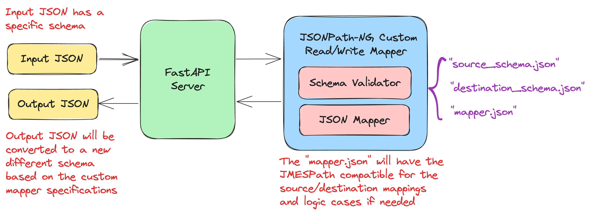

# JSONPATH-NG-EXPERIMENTS


This repository covers multiple experiments for advanced JSON Mappers with the help of the Python library [json-path-ng](https://github.com/h2non/jsonpath-ng) and a custom Mapper implementation.

## Software Architecture :trophy:

 <br>

## Summary/Overview :scroll:

- Core Python implementations on top of [json-path-ng](https://github.com/h2non/jsonpath-ng) and managed with [Poetry](https://python-poetry.org).
- API developed with [FastAPI](https://fastapi.tiangolo.com/lo/).
- Unit and Integration Tests for the source code with [PyTest](https://docs.pytest.org/en/latest).
- Continuous Integration on top of GitHub Actions with Code Quality Job and Unit Tests Coverage >90%.

## Usage :ghost:

Follow these steps to configure the project locally:

### Clone the repository

First, clone the repository:

```bash
git clone https://github.com/san99tiago/jsonpath-ng-experiments
cd jsonpath-ng-experiments
```

### Configure Python Dependencies with Poetry

To install [Poetry](https://python-poetry.org) and configure the virtual environment, please follow the steps based on your preferred install method:

- https://python-poetry.org/docs/

After poetry tool is installed, proceed to execute:

```bash
poetry shell
poetry install
```

### Execute locally the JSON Mapper with FastAPI

To easily run the FastAPI server, proceed with:

```bash
poe local-fastapi
```

### Execute the JSON Mapper

Now, in your preferred tool to execute API Requests, proceed to execute the following REST-API request and inject your JSON payload to be transformed:

- `[PATCH]` `http://127.0.0.1:8000/quotes`

### Real Example Payload/Response

The Example that will be shown, is based on the current JSON Mapper configured to transform some personal quotes from one source schema into a custom destination format. <br>

The actual mapping is configured at the file:

- [src/mapper/models/mapper.json](src/mapper/models/mapper.json)

Example Input Payload:

```json
{
  "miscellaneous": {
    "quotes": [
      {
        "uuid": "2008d4d2-49fd-48e4-a305-796b75953edd",
        "author": "Japanese Proverb",
        "sentence": "Discipline will sooner or later defeat intelligence",
        "score": 5,
        "details": {
          "source": "Instagram",
          "year": null
        },
        "filters": [
          {
            "quoteSentiment": "Positive",
            "quoteType": "Discipline",
            "importance": "HIGH"
          },
          {
            "quoteSentiment": "Positive",
            "quoteType": "Success",
            "importance": "LOW"
          }
        ]
      },
      {
        "uuid": "ab93c944-8c77-4e79-84e4-c78cb125f1ad",
        "author": "Alex Hormozi",
        "sentence": "The longer you delay the ask, the bigger the ask you can make",
        "score": 0,
        "details": {
          "source": "100M Offers",
          "year": 2021
        },
        "filters": []
      }
    ]
  }
}
```

Example JSON Response:

```json
{
  "quotes": [
    {
      "id": "2008d4d2-49fd-48e4-a305-796b75953edd",
      "author": "Japanese Proverb",
      "quote": "Discipline will sooner or later defeat intelligence",
      "quality": "AWESOME",
      "category": "Discipline",
      "sentiment": "Positive",
      "allTypes": [
        {
          "type": "Discipline"
        },
        {
          "type": "Success"
        }
      ]
    },
    {
      "id": "ab93c944-8c77-4e79-84e4-c78cb125f1ad",
      "author": "Alex Hormozi",
      "quote": "The longer you delay the ask, the bigger the ask you can make",
      "quality": "N/A"
    }
  ]
}
```

### Further Edits

In order to update the functionalities, please update:

- The JSON Mapper file [src/mapper/models/mapper.json](src/mapper/models/mapper.json), with the necessary "source" and "destination" paths.
- The Source Schema file [src/mapper/models/source_schema.json](src/mapper/models/source_schema.json), with the necessary schema.
- The Destination Schema file [src/mapper/models/destination_schema.json](src/mapper/models/destination_schema.json), with the necessary schema.

## Special thanks :beers:

- I am grateful to the talented individuals who have dedicated their time and effort to develop the exceptional open-source projects that have been used in the creation of this solution. <br>

## Author :musical_keyboard:

**Santiago Garcia Arango**

<table border="1">
    <tr>
        <td>
            <p align="center"></p>
        </td>
        <td>
            <p align="center">As a curious DevOps Engineer, I am deeply passionate about implementing cutting-edge cloud-based solutions on AWS.<br> I firmly believe that today's greatest challenges must be solved by the expertise of individuals who are truly passionate about their work.
            </p>
        </td>
    </tr>
</table>

## LICENSE

Copyright 2023 Santiago Garcia Arango, under the MIT license.
